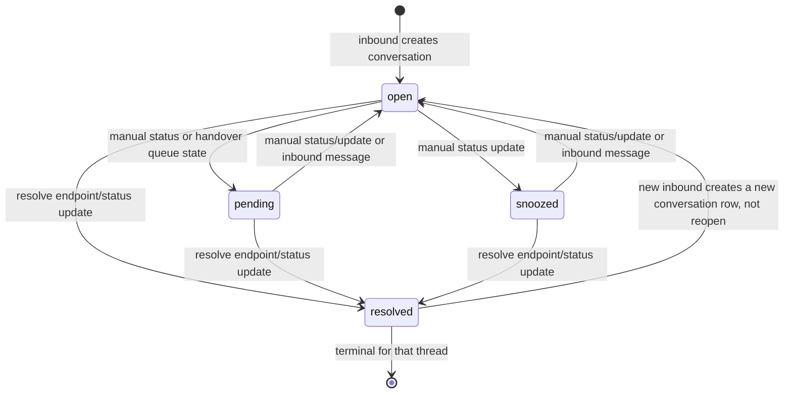
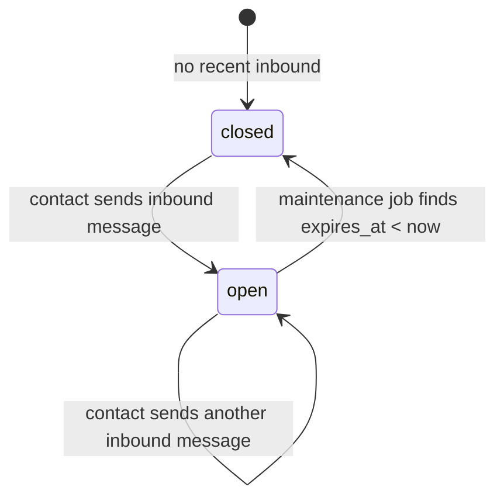
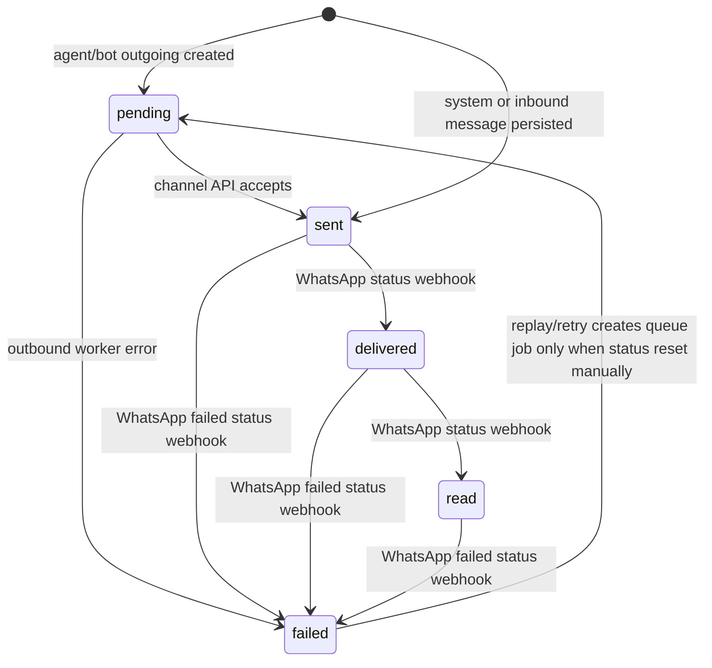
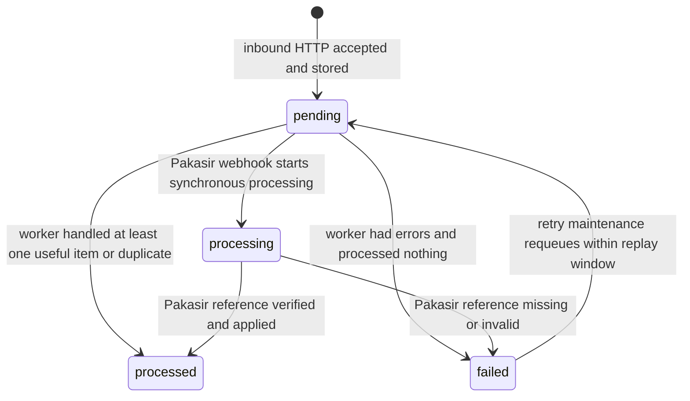
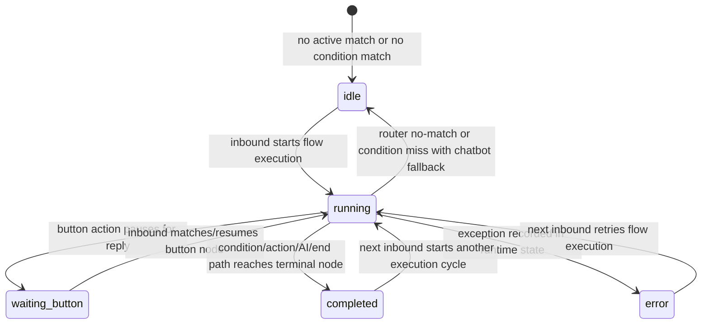
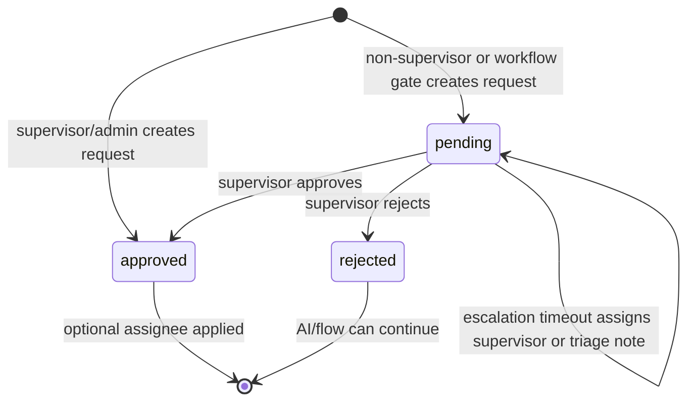
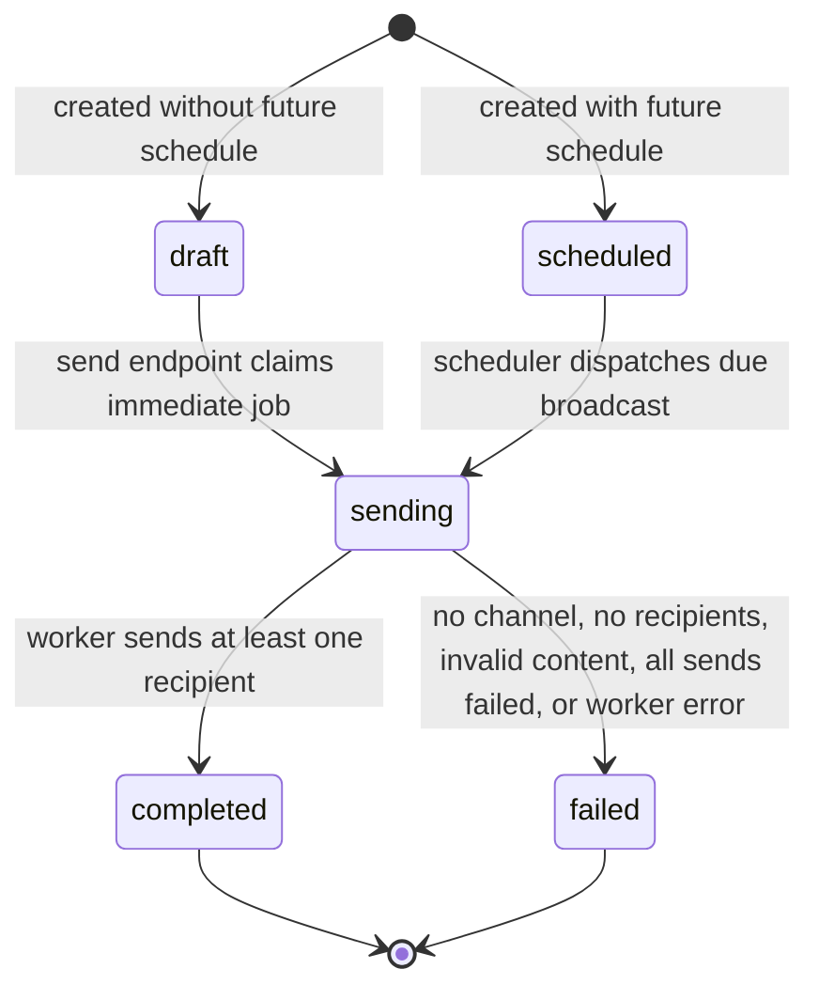
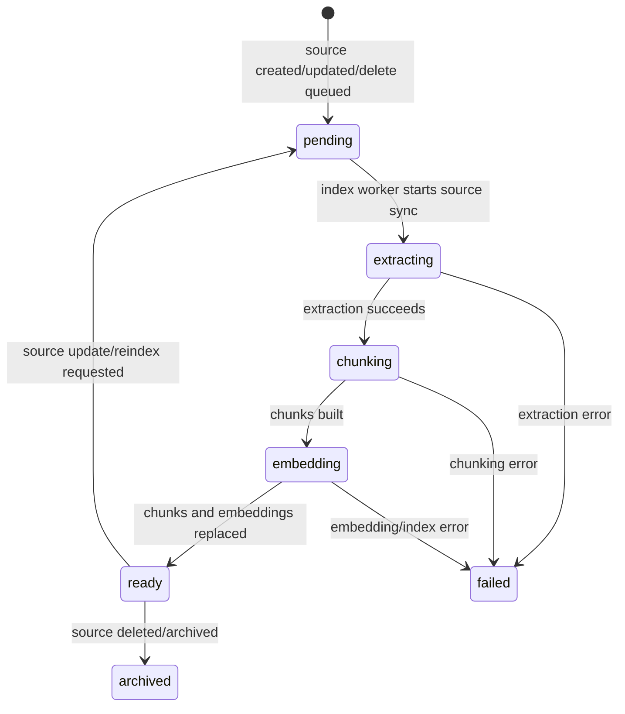
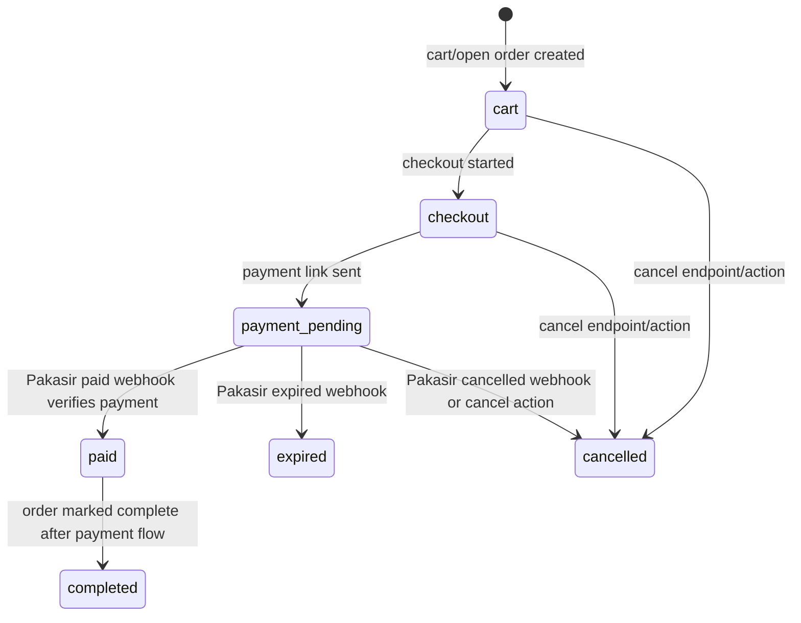

# State Machines — OpenCRM

Generated from backend source on 2026-04-29. This file documents persisted statuses, transitions, side effects, and known source-of-truth gaps.

## Source Files

| Domain | Source |
|---|---|
| Conversation | `apps/backend/src/modules/conversation/index.ts`, `apps/backend/src/modules/conversation/service.ts` |
| Inbound webhooks | `apps/backend/src/modules/webhook/service.ts` |
| Outbound/message workers | `apps/backend/src/modules/message/service.ts`, `apps/backend/src/workers/index.ts` |
| Flow runtime | `apps/backend/src/modules/flow/runtime-service.ts` |
| Handover | `apps/backend/src/modules/handover/service.ts` |
| Broadcast | `apps/backend/src/modules/broadcast/service.ts`, `apps/backend/src/workers/index.ts` |
| Knowledge indexing | `apps/backend/src/modules/knowledge/service.ts`, `apps/backend/src/modules/knowledge/indexing-service.ts` |
| Commerce payment | `apps/backend/src/modules/commerce/service.ts` |

## Conversation Status

Persisted on `conversations.status`, default `open`. API accepts free-form string on `POST/PATCH /conversations/:id/status`; UI/model code expects `open | pending | resolved | snoozed`.



| Transition | Trigger | Persistence | Realtime/business side effect |
|---|---|---|---|
| `* -> open` | WhatsApp/Instagram/TikTok inbound when no unresolved conversation exists | create `conversations` row with `status='open'` | emits `message:created`; business webhook `conversation.created` for new lead |
| `any non-resolved -> open` | inbound message on existing unresolved conversation | updates same conversation to `status='open'`, increments `unread_count`, refreshes message/activity/window timestamps | emits `message:created`; schedules flow runtime/auto-reply unless skipped |
| `any -> resolved` | `POST /conversations/:id/resolve` or status endpoint | sets `status='resolved'`, `resolved_at=now` | emits `conversation:resolved` to `app:{app_id}` and `conversation:{id}` |
| `any -> open/pending/snoozed` | status endpoint | sets `status`, clears `resolved_at` | emits `conversation:status_changed` |
| assignee change | assign/takeover/handover approval | updates `assignee_id`; updates `conversation_agents` primary row status `active`; writes assignment/activity history | emits `conversation:assigned`; business webhook `conversation.handled_by_updated` |
| read mark | `POST /conversations/:id/read` | sets `unread_count=0` | emits `conversation:read` |

Rules:

- Resolved conversations are not reused by inbound handlers; inbound source searches `status != 'resolved'` and creates a fresh thread if only resolved rows exist.
- `snoozed_until` exists in schema, but current status routes do not set it. A rebuild should either add an explicit snooze endpoint or treat `snoozed` as a label-only status until implemented.
- `pending` powers the handover queue: `HandoverService.getQueue` reads conversations with `status='pending'` plus latest `handover_requests` metadata.

## Messaging Window

WhatsApp/Instagram/TikTok conversations track customer reply windows using `messaging_window_open`, `is_within_messaging_window`, `messaging_window_opened_at`, and `messaging_window_expires_at`.



| Transition | Trigger | Persistence | Enforcement |
|---|---|---|---|
| `closed -> open` | inbound customer message | open flag true, within flag true, expiry refreshed | outbound free-form replies allowed |
| `open -> closed` | maintenance job `check-expired-windows` | open flag false, within flag false | emits `conversation:window_expired` to app and conversation rooms |
| send blocked | agent sends WhatsApp non-template after expiry | no message created | `422` with code `WHATSAPP_FREE_WINDOW_EXPIRED` and optional `follow_up_url` |

## Message Status

Persisted on `messages.status`. Message rows also record status history in `message_status_history` for outbound and WhatsApp webhook receipts.



| Status | Producer | Meaning |
|---|---|---|
| `pending` | `MessageService.sendMessage` for agent/bot | persisted and queued in BullMQ `outbound-messages` |
| `sent` | outbound worker or inbound webhook | API accepted outbound, or inbound customer message stored |
| `delivered` | WhatsApp status webhook | Meta delivery receipt |
| `read` | WhatsApp status webhook | Meta read receipt |
| `failed` | outbound worker or WhatsApp failed receipt | send rejected or provider status failed |

Realtime/events:

- New inbound and manual outgoing messages emit `message:created`.
- WhatsApp status receipts emit `message:status_updated` with `message_id`, `external_id`, `conversation_id`, `app_id`, `status`, `status_at`.
- Pending outgoing replay scans `message_type='outgoing' AND status='pending'` older than 15 seconds and re-adds BullMQ jobs.

## Webhook Event Status

Persisted on `webhook_events.status`.



| Status | Scope | Notes |
|---|---|---|
| `pending` | WhatsApp/Instagram/TikTok webhook ingest | created before BullMQ job; replay job can requeue stuck pending rows |
| `processed` | all webhook sources | set after successful processing; Pakasir uses idempotent early return when already processed |
| `failed` | all webhook sources | retryable for channel webhooks when retry count/window allows |
| `processing` | Pakasir only | synchronous payment webhook in progress |

## Flow Runtime Status

Runtime state is stored under `conversations.additional_attributes._flow_runtime` (the constant key in runtime service). Status values are not a Prisma enum.



Stored shape:

```ts
type FlowRuntimeState = {
  flow_id?: string
  cursor_node_id?: string | null
  status: 'idle' | 'running' | 'completed' | 'error' | 'waiting_button'
  waiting_button?: { node_id: string; options: string[] } | null
  variables: Record<string, unknown>
  last_executed_at?: string
  last_error?: string
}
```

Important behavior:

- `waiting_button` pauses chatbot fallback: runtime result returns `skipChatbot=true`.
- `idle` with reason `no_condition_match` usually lets classic chatbot auto-reply continue.
- Flow errors are fail-open for the pipeline: state is marked `error`, then webhook service can still proceed to auto-reply.

## Handover Request Status

Persisted on `handover_requests.status`; mirrored as `conversations.additional_attributes.handover.approval_state`.



| Transition | Trigger | Side effect |
|---|---|---|
| `* -> pending` | manual non-supervisor request or workflow approval gate | creates request, writes handover metadata, emits `handover:request_created` |
| `* -> approved` | supervisor/admin creates request | auto-assigns target agent when provided, logs `handover_approved` |
| `pending -> approved` | `approveRequest` | sets approver/timestamp, updates conversation handover metadata, resolves best assignee if missing, emits `handover:request_approved` |
| `pending -> rejected` | `rejectRequest` | sets rejecter/timestamp, metadata approval_state `rejected`, emits `handover:request_rejected` |
| `pending -> pending` | escalation timeout | increments escalation count and assigns supervisor; after escalation budget, sets `triage_status='pending_supervisor_note'` |

There is no persisted `expired` request status in source; timeout becomes escalation/triage while status remains `pending`.

## Broadcast Status

Persisted on `broadcasts.status`. API history maps stored values to uppercase UI statuses.



| Stored value | UI/history label | Producer |
|---|---|---|
| `draft` | `DRAFT` | create broadcast immediate/manual draft |
| `scheduled` | `SCHEDULED` | create/send with future schedule |
| `sending` | `PROCESSING` | send endpoint, scheduled dispatcher, broadcast worker |
| `completed` | `COMPLETED` | worker if `successCount > 0` |
| `failed` | `FAILED` | worker error, no active WA channel, no recipients, empty content, all recipients failed |
| `cancelled` | `CANCELLED` | mapper supports it; current service has no cancel transition |

Per-recipient `broadcast_logs.status`: `sent` or `failed` from worker; API also surfaces result rows as `PENDING`/`FAILED` in `target_audience.results`.

## Knowledge Source and Ingestion Status

Persisted on `knowledge_sources.status`, `knowledge_source_files.status`, and `knowledge_ingestion_jobs.status/stage`.



| Field | Values | Notes |
|---|---|---|
| `knowledge_sources.status` | `pending/extracting/chunking/embedding/ready/failed/archived` | normalized aliases: `processing -> embedding`, `error -> failed` |
| `knowledge_source_files.status` | `pending/extracting/chunking/ready/failed` | file row follows source lifecycle when present |
| `knowledge_ingestion_jobs.status` | `pending/running/completed/failed` | jobs also store stage: `ingest/extracting/chunking/embedding/completed/failed/purge` |

## Commerce Order and Invoice Status

Commerce is less centralized than conversation state; status values are strings persisted on orders/invoices and normalized by service helpers.



| Field | Values observed in source | Notes |
|---|---|---|
| `orders.journey_phase` | `cart`, `checkout`, `payment_pending`, `paid`, `cancelled`, `expired` | UI labels derive from phase map |
| `orders.order_status` | `pending`, `completed`, `cancelled`, `expired` | paid webhook sets completed in core path |
| `order_invoices.status` | `NOT_PAID`, `PAID`, `CANCELLED`, `EXPIRED` | normalized from provider webhook and detail verification |
| `stock_reservations.status` | `active`, `released`, `finalized` | finalized after payment; released after cancel/expire |

## Agent Presence and Assignment

| State field | Values | Source |
|---|---|---|
| `users.status` / roster status | `online`, `offline`, `break` | handover roster maps user status; default offline |
| `agent_availability.is_available` | boolean | auto-assignment/availability config |
| `conversation_agents.status` | `active` plus historical rows | assignment sets current primary row to active |

Auto-assignment should only choose agents that are active/available, within capacity, and allowed for the conversation channel.

## Rebuild Notes

- Keep statuses as strings unless converting the DB schema to enums; source currently tolerates arbitrary strings in several endpoints.
- Emit realtime events on state transitions, not just DB writes. Frontend depends on these events for live inbox updates.
- Treat payment and webhook processing as idempotent: both use external ids/references to avoid duplicate side effects.
