# Entity Relationship Diagrams

Generated from `apps/backend/prisma/schema.prisma` on 2026-04-29.

## Summary

| Metric | Value |
|---|---:|
| Prisma models | 112 |
| Explicit FK relations | 112 |
| Models with `app_id`/`appId` | 60 |
| Models with `organization_id`/`organizationId` | 9 |

| Domain | Models | FK relations |
|---|---:|---:|
| Agents & Handover | 15 | 11 |
| AI, Knowledge & Flow | 24 | 43 |
| Auth & Tenant | 16 | 12 |
| Commerce | 8 | 0 |
| Conversation & Channels | 25 | 27 |
| CRM, Forms & Customer | 10 | 10 |
| Integration & Misc | 14 | 9 |

## Multi-Tenancy Pattern

- Primary tenant table: `apps` with public slug `apps.app_id` and internal UUID `apps.id`.
- New organization model links to app via `organization.appId -> apps.id`.
- Most business tables carry `app_id` as FK to `apps.id`; some legacy tables carry `account_id` or nullable `app_id`.
- Request tenant resolution accepts organization slug, Better Auth session, legacy `X-App-Id`, or integration keys.

App-scoped models:

- `agent_availability`
- `agent_settings`
- `ai_evaluations`
- `ai_playground_guardrails`
- `ai_playground_metric_items`
- `ai_playground_models`
- `ai_playground_personas`
- `ai_playground_routing_strategies`
- `ai_playground_sessions`
- `ai_playground_turns`
- `ai_response_logs`
- `ai_response_templates`
- `ai_settings`
- `app_installations`
- `app_usage_logs`
- `apps`
- `auto_assign_rules`
- `auto_responder_rules`
- `automation_flows`
- `broadcasts`
- `canned_responses`
- `channel_accounts`
- `chatbots`
- `contact_custom_fields`
- `contact_tags`
- `contacts`
- `conversations`
- `credit_transactions`
- `customer_level_settings`
- `divisions`
- `forms`
- `handover_requests`
- `inboxes`
- `knowledge_categories`
- `knowledge_chunks`
- `knowledge_faqs`
- `knowledge_ingestion_jobs`
- `knowledge_query_chunks`
- `knowledge_query_logs`
- `knowledge_source_files`
- `knowledge_sources`
- `labels`
- `media_files`
- `messages`
- `office_hours`
- `orders`
- `organization`
- `pipelines`
- `product_variants`
- `products`
- `sla_policies`
- `stock_movements`
- `stock_reservations`
- `subscriptions`
- `teams`
- `template_variables`
- `users`
- `webhook_events`
- `webhooks`
- `whatsapp_channels`

Organization-scoped models:

- `credit_transactions`
- `invitation`
- `member`
- `orders`
- `product_variants`
- `products`
- `stock_movements`
- `stock_reservations`
- `subscriptions`

## Agents & Handover

```mermaid
erDiagram
    apps ||--o{ agent_availability : "app_id"
    divisions ||--o{ agent_divisions : "division_id"
    apps ||--o{ agent_settings : "app_id"
    auto_assign_rules ||--o{ assignment_history : "auto_assign_rule_id"
    apps ||--o{ auto_assign_rules : "app_id"
    auto_assign_rules ||--o{ handover_requests : "source_rule_id"
    apps ||--o{ handover_requests : "app_id"
    apps ||--o{ divisions : "app_id"
    teams ||--o{ team_members : "team_id"
    accounts ||--o{ teams : "account_id"
    accounts {
        string id PK
    }
    agent_availability {
        string id PK
        string user_id
        string app_id FK
        boolean is_available
        int max_conversations
        int current_conversations
        string skills
        string languages
        datetime last_assigned_at
        datetime updated_at
        string __more_fields
    }
    agent_channel_accounts {
        string id PK
        string user_id
        string channel_type
        string account_id FK
        datetime created_at
        channel_accounts channel_accounts
    }
    agent_channels {
        string id PK
        string user_id
        string channel_type
        datetime created_at
    }
    agent_divisions {
        string user_id
        string division_id FK
        datetime created_at
        divisions divisions
    }
    agent_inbox_assignments {
        string id PK
        string user_id
        string inbox_id
        boolean is_active
        datetime assigned_at
        string assigned_by
    }
    agent_presence {
        string user_id PK
        string status
        datetime last_seen_at
    }
    agent_settings {
        string id PK
        string app_id FK UK
        string default_ticket_board_id
        boolean auto_assign_agent
        boolean agent_can_takeover_unserved
        boolean agent_can_access_customers
        boolean agent_can_import_export_customers
        boolean agent_can_send_broadcast
        boolean agent_can_broadcast_in_service_window
        boolean hide_agent_status_toggle
        string __more_fields
    }
    agent_settings_overrides {
        string id PK
        string user_id UK
        boolean auto_assign_agent
        boolean agent_can_takeover_unserved
        boolean agent_can_access_customers
        boolean agent_can_import_export_customers
        boolean agent_can_send_broadcast
        boolean agent_can_broadcast_in_service_window
        boolean hide_agent_status_toggle
        boolean hide_customer_id
        string __more_fields
    }
    apps {
        string id PK
    }
    assignment_history {
        string id PK
        string conversation_id
        string assigned_to
        string assigned_from
        string assignment_type
        string auto_assign_rule_id FK
        datetime created_at
        auto_assign_rules auto_assign_rules
    }
    auto_assign_rules {
        string id PK
        string app_id FK
        string name
        string description
        string rule_type
        int priority
        json conditions
        string target_type
        string target_ids
        string fallback_action
        string __more_fields
    }
    conversation_agents {
        string id PK
        string conversation_id
        string agent_id
        string assigned_by
        datetime assigned_at
        datetime removed_at
        string removed_by
        boolean is_primary
        string status
    }
    divisions {
        string id PK
        string name
        string description
        string parent_division_id
        datetime created_at
        datetime updated_at
        string app_id FK
        string color
        agent_divisions agent_divisions
        divisions divisions
        string __more_fields
    }
    handover_requests {
        string id PK
        string app_id FK
        string conversation_id
        string request_type
        string requested_by
        string target_agent_id
        string status
        string request_note
        string approval_note
        string approved_by
        string __more_fields
    }
    team_members {
        string team_id FK
        string user_id
        teams teams
    }
    teams {
        string id PK
        string account_id FK
        string name
        string description
        boolean allow_auto_assign
        datetime created_at
        datetime updated_at
        datetime deleted_at
        string app_id
        conversations conversations
        string __more_fields
    }
```

## AI, Knowledge & Flow

```mermaid
erDiagram
    apps ||--o{ ai_evaluations : "app_id"
    chatbots ||--o{ ai_evaluations : "chatbot_id"
    apps ||--o{ ai_response_templates : "app_id"
    apps ||--o{ ai_settings : "app_id"
    apps ||--o{ ai_playground_models : "app_id"
    apps ||--o{ ai_playground_routing_strategies : "app_id"
    apps ||--o{ ai_playground_personas : "app_id"
    apps ||--o{ ai_playground_guardrails : "app_id"
    apps ||--o{ ai_playground_metric_items : "app_id"
    apps ||--o{ ai_playground_sessions : "app_id"
    apps ||--o{ ai_playground_turns : "app_id"
    ai_playground_sessions ||--o{ ai_playground_turns : "session_id"
    apps ||--o{ automation_flows : "app_id"
    accounts ||--o{ automation_rules : "account_id"
    apps ||--o{ chatbots : "app_id"
    knowledge_sources ||--o{ embeddings : "source_id"
    knowledge_faqs ||--o{ embeddings : "faq_id"
    apps ||--o{ knowledge_categories : "app_id"
    chatbots ||--o{ knowledge_categories : "chatbot_id"
    apps ||--o{ knowledge_faqs : "app_id"
    knowledge_categories ||--o{ knowledge_faqs : "category_id"
    chatbots ||--o{ knowledge_faqs : "chatbot_id"
    apps ||--o{ knowledge_sources : "app_id"
    knowledge_categories ||--o{ knowledge_sources : "category_id"
    chatbots ||--o{ knowledge_sources : "chatbot_id"
    apps ||--o{ knowledge_source_files : "app_id"
    chatbots ||--o{ knowledge_source_files : "chatbot_id"
    knowledge_sources ||--o{ knowledge_source_files : "source_id"
    apps ||--o{ knowledge_ingestion_jobs : "app_id"
    chatbots ||--o{ knowledge_ingestion_jobs : "chatbot_id"
    knowledge_sources ||--o{ knowledge_ingestion_jobs : "source_id"
    knowledge_source_files ||--o{ knowledge_ingestion_jobs : "source_file_id"
    apps ||--o{ knowledge_chunks : "app_id"
    chatbots ||--o{ knowledge_chunks : "chatbot_id"
    knowledge_sources ||--o{ knowledge_chunks : "source_id"
    knowledge_source_files ||--o{ knowledge_chunks : "file_id"
    apps ||--o{ knowledge_query_logs : "app_id"
    chatbots ||--o{ knowledge_query_logs : "chatbot_id"
    apps ||--o{ knowledge_query_chunks : "app_id"
    chatbots ||--o{ knowledge_query_chunks : "chatbot_id"
    knowledge_query_logs ||--o{ knowledge_query_chunks : "query_log_id"
    knowledge_chunks ||--o{ knowledge_query_chunks : "chunk_id"
    knowledge_sources ||--o{ knowledge_query_chunks : "source_id"
    accounts {
        string id PK
    }
    ai_evaluations {
        string id PK
        string app_id FK
        string chatbot_id FK
        string content
        string type
        json metadata
        datetime created_at
        datetime updated_at
        datetime deleted_at
        ai_evaluation_messages ai_evaluation_messages
        string __more_fields
    }
    ai_model_pricing {
        string id PK
        string model_name UK
        decimal cost_per_request
        string description
        boolean is_active
        datetime updated_at
    }
    ai_playground_guardrails {
        string id PK
        string app_id FK
        string guardrail_key
        string label
        boolean enabled
        int sort_order
        datetime created_at
        datetime updated_at
        apps apps
    }
    ai_playground_metric_items {
        string id PK
        string app_id FK
        string metric_key
        string label
        string value
        string delta
        string trend
        string positive_when
        int sort_order
        datetime created_at
        string __more_fields
    }
    ai_playground_models {
        string id PK
        string app_id FK
        string model_key
        string name
        string vendor
        string context_window
        decimal price_in
        decimal price_out
        string speed
        string tier
        string __more_fields
    }
    ai_playground_personas {
        string id PK
        string app_id FK
        string persona_key
        string label
        string system_instruction
        boolean is_default
        int sort_order
        datetime created_at
        datetime updated_at
        apps apps
        string __more_fields
    }
    ai_playground_routing_strategies {
        string id PK
        string app_id FK
        string strategy_key
        string label
        string description
        json routing_rules
        boolean is_active
        int sort_order
        datetime created_at
        datetime updated_at
        string __more_fields
    }
    ai_playground_sessions {
        string id PK
        string app_id FK
        string selected_model_id
        string selected_strategy_id
        string selected_persona_id
        string status
        datetime created_at
        datetime updated_at
        apps apps
        ai_playground_models selected_model
        string __more_fields
    }
    ai_playground_turns {
        string id PK
        string app_id FK
        string session_id FK
        string role
        string content
        string model_name
        int tokens_in
        int tokens_out
        int latency_ms
        decimal cost_usd
        string __more_fields
    }
    ai_response_logs {
        string id PK
        string app_id
        string chatbot_id
        string conversation_id
        string entrypoint
        string provider
        string model_name
        int prompt_tokens
        int completion_tokens
        int total_tokens
        string __more_fields
    }
    ai_response_templates {
        string id PK
        string app_id FK
        string name
        string template
        json variables
        string category
        string language
        boolean is_active
        int usage_count
        datetime created_at
        string __more_fields
    }
    ai_settings {
        string id PK
        string app_id FK UK
        string ai_mode
        string model_provider
        string model_name
        decimal temperature
        int max_tokens
        decimal auto_reply_confidence
        string handoff_keywords
        string response_tone
        string __more_fields
    }
    apps {
        string id PK
    }
    automation_flows {
        string id PK
        string app_id FK
        string name
        string description
        json nodes
        json edges
        boolean active
        datetime created_at
        datetime updated_at
        apps apps
    }
    automation_rules {
        string id PK
        string account_id FK
        string name
        string description
        string event_name
        json conditions
        json actions
        boolean active
        datetime created_at
        accounts accounts
    }
    chatbots {
        string id PK
        string app_id FK
        string name
        string description
        string model
        string prompt
        string welcome_msg
        string agent_transfer
        decimal temperature
        int history_limit
        string __more_fields
    }
    embeddings {
        string id PK
        string source_id FK
        string faq_id FK
        string content_chunk
        int chunk_index
        Unsupported("vector") embedding
        datetime created_at
        knowledge_sources knowledge_sources
        knowledge_faqs knowledge_faqs
    }
    knowledge_categories {
        string id PK
        string app_id FK
        string name
        string description
        string parent_id
        int position
        datetime created_at
        string chatbot_id FK
        apps apps
        chatbots chatbots
        string __more_fields
    }
    knowledge_chunks {
        string id PK
        string app_id FK
        string chatbot_id FK
        string source_id FK
        string file_id FK
        int source_version
        int chunk_index
        string chunk_text
        string chunk_hash
        int char_count
        string __more_fields
    }
    knowledge_faqs {
        string id PK
        string app_id FK
        string category_id FK
        string question
        string answer
        string keywords
        int priority
        boolean is_active
        int view_count
        int helpful_count
        string __more_fields
    }
    knowledge_ingestion_jobs {
        string id PK
        string app_id FK
        string chatbot_id FK
        string source_id FK
        string source_file_id FK
        string trigger
        string stage
        string status
        int attempts
        datetime started_at
        string __more_fields
    }
    knowledge_query_chunks {
        string id PK
        string app_id FK
        string chatbot_id FK
        string query_log_id FK
        string chunk_id FK
        string source_id FK
        int rank
        decimal score
        string locator_label
        string snippet
        string __more_fields
    }
    knowledge_query_logs {
        string id PK
        string app_id FK
        string chatbot_id FK
        string channel
        string query_text
        json selected_source_ids
        int top_k
        int retrieval_ms
        boolean rag_hit
        int hit_chunk_count
        string __more_fields
    }
    knowledge_source_files {
        string id PK
        string app_id FK
        string chatbot_id FK
        string source_id FK
        string file_name
        string mime_type
        Bigint file_size_bytes
        string checksum_sha256
        string storage_key
        string storage_url
        string __more_fields
    }
    knowledge_sources {
        string id PK
        string title
        string content
        string type
        string format
        json metadata
        datetime created_at
        string app_id FK
        string chatbot_id FK
        string category_id FK
        string __more_fields
    }
```

## Auth & Tenant

```mermaid
erDiagram
    users ||--o{ session : "userId"
    users ||--o{ account : "userId"
    apps ||--o{ organization : "appId"
    organization ||--o{ member : "organizationId"
    users ||--o{ member : "userId"
    organization ||--o{ invitation : "organizationId"
    users ||--o{ invitation : "inviterId"
    app_categories ||--o{ app_center : "category_id"
    app_center ||--o{ app_installations : "app_id"
    apps ||--o{ app_usage_logs : "app_id"
    organization ||--o{ credit_transactions : "organization_id"
    apps ||--o{ credit_transactions : "app_id"
    account {
        string id PK
        string accountId
        string providerId
        string userId FK
        users user
        string accessToken
        string refreshToken
        string idToken
        datetime accessTokenExpiresAt
        datetime refreshTokenExpiresAt
        string __more_fields
    }
    accounts {
        string id PK
        string name
        datetime created_at
        automation_rules automation_rules
        broadcasts broadcasts
        canned_responses canned_responses
        contacts contacts
        conversations conversations
        inboxes inboxes
        labels labels
        string __more_fields
    }
    app_categories {
        string id PK
        string name
        string slug UK
        string description
        string icon
        int sort_order
        datetime created_at
        datetime updated_at
        app_center app_center
    }
    app_center {
        string id PK
        string name
        string slug UK
        string author
        string caption
        string description
        string category_id FK
        string icon_url
        string banner_url
        string version
        string __more_fields
    }
    app_installations {
        string id PK
        string app_id FK
        string app_id_org
        string status
        boolean is_enabled
        string installed_by
        json settings
        datetime installed_at
        datetime updated_at
        app_center app_center
    }
    app_usage_logs {
        string id PK
        string app_id FK
        string endpoint
        string method
        int status_code
        int response_time_ms
        string ip_address
        string user_agent
        datetime created_at
        apps apps
    }
    apps {
        string id PK
        string app_id UK
        string app_secret_hash
        string app_name
        string description
        boolean is_active
        json allowed_origins
        int rate_limit_per_minute
        datetime last_used_at
        datetime created_at
        string __more_fields
    }
    credit_transactions {
        string id PK
        string organization_id FK
        organization organization
        string app_id FK
        apps apps
        decimal amount
        string type
        string description
        json metadata
        datetime created_at
        string __more_fields
    }
    invitation {
        string id PK
        string organizationId FK
        organization organization
        string email
        string role
        string status
        datetime expiresAt
        string inviterId FK
        users inviter
    }
    member {
        string id PK
        string organizationId FK
        organization organization
        string userId FK
        users user
        string role
        datetime createdAt
    }
    organization {
        string id PK
        string name
        string slug UK
        string logo
        string description
        string createdBy
        datetime createdAt
        string metadata
        string appId FK UK
        decimal aiCredits
        string __more_fields
    }
    platform_settings {
        string key PK
        string value
        string updated_by
        datetime updated_at
    }
    session {
        string id PK
        datetime expiresAt
        string token UK
        datetime createdAt
        datetime updatedAt
        string ipAddress
        string userAgent
        string userId FK
        users user
        string activeOrganizationId
    }
    top_up_packages {
        string id PK
        string name UK
        decimal price_usd
        decimal credits
        string description
        boolean is_active
        int sort_order
    }
    users {
        string id PK
        string account_id
        string name
        string email UK
        boolean emailVerified
        string password
        string role
        string avatar_url
        boolean active
        string phone_number
        string __more_fields
    }
    verification {
        string id PK
        string identifier
        string value
        datetime expiresAt
        datetime createdAt
        datetime updatedAt
    }
```

## Commerce

```mermaid
erDiagram
    order_invoices {
        string id PK
        string order_id
        decimal amount
        string status
        string provider
        string provider_invoice_id
        string payment_method
        string payment_number
        string payment_link
        string checkout_url
        string __more_fields
    }
    order_items {
        string id PK
        string order_id
        string product_id
        string variant_id
        string product_name
        string variant_name
        int quantity
        decimal unit_price
        decimal line_total
        decimal price
        string __more_fields
    }
    orders {
        string id PK
        string organization_id
        string app_id
        string contact_id
        string conversation_id
        Bigint order_number
        string order_status
        string payment_type
        string payment_method
        string payment_provider
        string __more_fields
    }
    product_variants {
        string id PK
        string product_id
        string app_id
        string organization_id
        string name
        string sku
        string image_url
        json attributes
        decimal price
        int stock_on_hand
        string __more_fields
    }
    products {
        string id PK
        string app_id
        string organization_id
        string name
        string sku
        string image_url
        string description
        decimal base_price
        boolean is_active
        json metadata
        string __more_fields
    }
    stock_movements {
        string id PK
        string app_id
        string organization_id
        string variant_id
        string reservation_id
        string order_id
        string movement_type
        int quantity
        int stock_before
        int stock_after
        string __more_fields
    }
    stock_reservations {
        string id PK
        string app_id
        string organization_id
        string order_id
        string order_item_id
        string variant_id
        int quantity
        string status
        string reason
        datetime expires_at
        string __more_fields
    }
    subscriptions {
        string id PK
        string organization_id
        string app_id
        string contact_id
        Bigint subscription_number
        string status
        string subscription_type
        string item_name
        decimal billing_amount
        int cycles
        string __more_fields
    }
```



## Conversation & Channels

```mermaid
erDiagram
    broadcasts ||--o{ broadcast_logs : "broadcast_id"
    contacts ||--o{ broadcast_logs : "contact_id"
    messages ||--o{ broadcast_logs : "message_id"
    accounts ||--o{ broadcasts : "account_id"
    accounts ||--o{ canned_responses : "account_id"
    apps ||--o{ channel_accounts : "app_id"
    apps ||--o{ contact_custom_fields : "app_id"
    contact_tags ||--o{ contact_tag_assignments : "tag_id"
    apps ||--o{ contact_tags : "app_id"
    accounts ||--o{ contacts : "account_id"
    conversations ||--o{ conversation_labels : "conversation_id"
    labels ||--o{ conversation_labels : "label_id"
    conversations ||--o{ conversation_participants : "conversation_id"
    accounts ||--o{ conversations : "account_id"
    contacts ||--o{ conversations : "contact_id"
    inboxes ||--o{ conversations : "inbox_id"
    accounts ||--o{ inboxes : "account_id"
    accounts ||--o{ labels : "account_id"
    conversations ||--o{ messages : "conversation_id"
    accounts ||--o{ webhooks : "account_id"
    apps ||--o{ webhooks : "app_id"
    inboxes ||--o{ webhooks : "inbox_id"
    inboxes ||--o{ whatsapp_channels : "inbox_id"
    accounts {
        string id PK
    }
    ai_conversation_contexts {
        string id PK
        string conversation_id UK
        string context_summary
        json entities
        int ai_reply_count
        string last_ai_action
        datetime last_ai_action_at
        boolean human_takeover
        datetime human_takeover_at
        datetime updated_at
    }
    ai_evaluation_messages {
        string id PK
        string evaluation_id FK
        string role
        string message
        string msg_id
        string media_url
        string media_type
        string conversation_id
        datetime msg_created_at
        datetime created_at
        string __more_fields
    }
    apps {
        string id PK
    }
    broadcast_logs {
        string id PK
        string broadcast_id FK
        string contact_id FK
        string message_id FK
        string status
        string error_message
        datetime created_at
        broadcasts broadcasts
        contacts contacts
        messages messages
    }
    broadcasts {
        string id PK
        string account_id FK
        string title
        string message_type
        string message_content
        json template_params
        json target_audience
        string status
        datetime scheduled_at
        int total_recipients
        string __more_fields
    }
    canned_responses {
        string id PK
        string account_id FK
        string short_code
        string content
        datetime created_at
        string app_id
        accounts accounts
    }
    channel_accounts {
        string id PK
        string app_id FK
        string channel_type
        string name
        json account_data
        boolean active
        datetime created_at
        datetime updated_at
        agent_channel_accounts agent_channel_accounts
        apps apps
    }
    contact_custom_fields {
        string id PK
        string field_key
        string field_label
        string field_type
        json options
        boolean is_required
        boolean is_visible
        int display_order
        datetime created_at
        string app_id FK
        string __more_fields
    }
    contact_notes {
        string id PK
        string contact_id
        string user_id
        string content
        datetime created_at
        datetime updated_at
    }
    contact_tag_assignments {
        string contact_id
        string tag_id FK
        datetime assigned_at
        contact_tags contact_tags
    }
    contact_tags {
        string id PK
        string app_id FK
        string name
        string color
        datetime created_at
        contact_tag_assignments contact_tag_assignments
        apps apps
    }
    contacts {
        string id PK
        string account_id FK
        string name
        string email
        string phone_number
        string avatar_url
        string identifier UK
        string channel_type
        json metadata
        json additional_attributes
        string __more_fields
    }
    conversation_activity_log {
        string id PK
        string conversation_id
        string action
        string actor_id
        string actor_type
        string target_id
        json metadata
        datetime created_at
    }
    conversation_labels {
        string conversation_id FK
        string label_id FK
        conversations conversations
        labels labels
    }
    conversation_notes {
        string id PK
        string conversation_id
        string user_id
        string content
        datetime created_at
        datetime updated_at
    }
    conversation_participants {
        string conversation_id FK
        string user_id
        conversations conversations
    }
    conversation_ratings {
        string id PK
        string conversation_id UK
        string contact_id
        int rating
        string feedback
        datetime created_at
    }
    conversation_sales {
        string conversation_id PK
        string pipeline_id FK
        string stage_id FK
        decimal deal_value
        int probability_snapshot
        decimal expected_revenue
        datetime stage_entered_at
        json stage_history
        json metadata
        datetime created_at
        string __more_fields
    }
    conversations {
        string id PK
        string account_id FK
        string inbox_id FK
        string contact_id FK
        string channel_type
        string assignee_id
        string team_id FK
        string status
        int unread_count
        string priority
        string __more_fields
    }
    inboxes {
        string id PK
        string account_id FK
        string name
        string channel_type
        json channel_config
        datetime created_at
        datetime updated_at
        string app_id
        datetime deleted_at
        string chatbot_id
        string __more_fields
    }
    labels {
        string id PK
        string account_id FK
        string title
        string description
        string color
        datetime created_at
        string app_id
        string badge_url
        datetime deleted_at
        boolean is_visible
        string __more_fields
    }
    message_status_history {
        string id PK
        string message_id
        string external_message_id
        string status
        string previous_status
        string error_code
        string error_title
        string error_message
        json error_details
        datetime timestamp
        string __more_fields
    }
    messages {
        string id PK
        string conversation_id FK
        string message_type
        string content
        json content_attributes
        string content_type
        string sender_id
        string sender_type
        boolean private
        string status
        string __more_fields
    }
    webhook_events {
        string id PK
        string source
        string event_type
        json raw_payload
        json headers
        string status
        datetime processed_at
        string error_message
        int retry_count
        string external_id
        string __more_fields
    }
    webhooks {
        string id PK
        string account_id FK
        string app_id FK
        string inbox_id FK
        string name
        string url
        json subscriptions
        boolean is_active
        string secret
        json headers
        string __more_fields
    }
    whatsapp_channels {
        string id PK
        string inbox_id FK
        string phone_number
        string phone_number_id
        string api_key
        string waba_id
        datetime created_at
        string name
        string display_phone_number
        string verified_name
        string __more_fields
    }
```



## CRM, Forms & Customer

```mermaid
erDiagram
    apps ||--o{ customer_level_settings : "app_id"
    form_submissions ||--o{ form_extraction_logs : "submission_id"
    forms ||--o{ form_fields : "form_id"
    form_fields ||--o{ form_submission_values : "field_id"
    form_submissions ||--o{ form_submission_values : "submission_id"
    forms ||--o{ form_submissions : "form_id"
    apps ||--o{ forms : "app_id"
    form_templates ||--o{ forms : "template_id"
    pipelines ||--o{ pipeline_stages : "pipeline_id"
    apps ||--o{ pipelines : "app_id"
    apps {
        string id PK
    }
    custom_attribute_definitions {
        int id PK
        string attribute_display_name
        string attribute_key
        string attribute_model
        string attribute_description
        json attribute_values
        datetime created_at
    }
    customer_level_settings {
        string id PK
        string app_id FK UK
        string vip_chatbot_id
        string premium_chatbot_id
        string basic_chatbot_id
        datetime created_at
        datetime updated_at
        apps apps
    }
    form_extraction_logs {
        string id PK
        string submission_id FK
        string message_id
        string raw_text
        json ai_response
        int extracted_count
        boolean success
        string error_message
        int processing_time_ms
        datetime created_at
        string __more_fields
    }
    form_fields {
        string id PK
        string form_id FK
        string field_key
        string label
        string field_type
        boolean is_required
        int order_no
        json validation
        json ai_aliases
        string ai_context
        string __more_fields
    }
    form_submission_values {
        string submission_id FK
        string field_id FK
        string value
        string normalized_value
        string source
        int confidence
        string extracted_from_message_id
        datetime extracted_at
        boolean is_valid
        string validation_error
        string __more_fields
    }
    form_submissions {
        string id PK
        string form_id FK
        string conversation_id
        string status
        int confidence_score
        string extraction_method
        int required_fields_count
        int filled_fields_count
        int completion_percentage
        datetime created_at
        string __more_fields
    }
    form_templates {
        string id PK
        string name
        string description
        string industry
        json schema
        boolean is_public
        datetime created_at
        datetime updated_at
        forms forms
    }
    forms {
        string id PK
        string inbox_id
        string name
        string description
        string template_id FK
        boolean is_active
        boolean auto_extract
        int confidence_threshold
        datetime created_at
        datetime updated_at
        string __more_fields
    }
    pipeline_stages {
        string id PK
        string pipeline_id FK
        string name
        int stage_order
        string stage_type
        int probability
        string color
        json automation_rules
        datetime created_at
        datetime updated_at
        string __more_fields
    }
    pipelines {
        string id PK
        string name
        string pipeline_type
        boolean is_default
        json settings
        datetime created_at
        datetime updated_at
        string app_id FK
        conversation_sales conversation_sales
        pipeline_stages pipeline_stages
        string __more_fields
    }
```

## Integration & Misc

```mermaid
erDiagram
    auto_responder_rules ||--o{ auto_responder_logs : "rule_id"
    apps ||--o{ auto_responder_rules : "app_id"
    meta_ads_accounts ||--o{ meta_ads_campaigns : "ads_account_id"
    meta_ads_accounts ||--o{ meta_ads_insights : "ads_account_id"
    meta_ads_campaigns ||--o{ meta_ads_insights : "campaign_id"
    apps ||--o{ office_hours : "app_id"
    sla_policies ||--o{ sla_breach_events : "sla_policy_id"
    apps ||--o{ sla_policies : "app_id"
    apps ||--o{ template_variables : "app_id"
    apps {
        string id PK
    }
    auto_responder_logs {
        string id PK
        string rule_id FK
        string conversation_id
        string message_id
        datetime triggered_at
        boolean response_sent
        string response_message_id
        json metadata
        auto_responder_rules auto_responder_rules
    }
    auto_responder_rules {
        string id PK
        string inbox_id
        string name
        string description
        string trigger_type
        json trigger_config
        string response_type
        string response_content
        int response_delay_seconds
        int max_triggers_per_conversation
        string __more_fields
    }
    consent_logs {
        string id PK
        string contact_id
        string status
        string purpose
        string source
        string captured_by
        string ip_address
        string user_agent
        string notes
        datetime created_at
    }
    media_files {
        string id PK
        string app_id
        string platform
        string media_id
        string message_id
        string media_type
        string mime_type
        string filename
        string caption
        Bigint file_size
        string __more_fields
    }
    mentions {
        int id PK
        int user_id
        int conversation_id
        int message_id
        datetime created_at
    }
    meta_ads_accounts {
        string id PK
        string app_id_org
        string fb_account_id
        string fb_account_name
        string fb_business_name
        string currency
        string country_code
        string access_token
        datetime token_expires_at
        boolean is_active
        string __more_fields
    }
    meta_ads_campaigns {
        string id PK
        string ads_account_id FK
        string campaign_id
        string name
        string objective
        string status
        decimal daily_budget
        decimal lifetime_budget
        json metadata
        datetime created_at
        string __more_fields
    }
    meta_ads_insights {
        string id PK
        string ads_account_id FK
        string campaign_id FK
        datetime date_start
        datetime date_stop
        Bigint impressions
        Bigint reach
        Bigint clicks
        decimal spend
        decimal cpc
        string __more_fields
    }
    migrations {
        int id PK
        string name UK
        datetime run_at
    }
    office_hours {
        string id PK
        string inbox_id
        int day_of_week
        datetime open_time
        datetime close_time
        boolean is_active
        string timezone
        datetime created_at
        datetime updated_at
        string app_id FK
        string __more_fields
    }
    sla_breach_events {
        string id PK
        string conversation_id
        string sla_policy_id FK
        string breach_type
        datetime due_at
        datetime breached_at
        boolean notified
        boolean resolved
        datetime created_at
        sla_policies sla_policies
    }
    sla_policies {
        string id PK
        string app_id FK
        string name
        string description
        int first_response_time
        int resolution_time
        json conditions
        boolean escalate_on_breach
        string escalation_agent_id
        json business_hours
        string __more_fields
    }
    stage_transitions {
        string id PK
        string conversation_id
        string from_stage_id
        string to_stage_id
        string user_id
        string transition_type
        string notes
        datetime created_at
        pipeline_stages pipeline_stages_stage_transitions_from_stage_idTopipeline_stages
        pipeline_stages pipeline_stages_stage_transitions_to_stage_idTopipeline_stages
    }
    template_variables {
        string id PK
        string app_id FK
        string name
        string category
        string value
        string fallback_value
        datetime created_at
        datetime updated_at
        apps apps
    }
```




## Full Model Relationship Index

| Model | Domain | App scoped | Org scoped | FK relations |
|---|---|---|---|---|
| `account` | Auth & Tenant | no | no | userId->users.id |
| `accounts` | Auth & Tenant | no | no | - |
| `agent_availability` | Agents & Handover | yes | no | app_id->apps.id |
| `agent_channel_accounts` | Agents & Handover | no | no | account_id->channel_accounts.id |
| `agent_channels` | Agents & Handover | no | no | - |
| `agent_divisions` | Agents & Handover | no | no | division_id->divisions.id |
| `agent_inbox_assignments` | Agents & Handover | no | no | - |
| `agent_presence` | Agents & Handover | no | no | - |
| `agent_settings` | Agents & Handover | yes | no | app_id->apps.id |
| `agent_settings_overrides` | Agents & Handover | no | no | - |
| `ai_conversation_contexts` | Conversation & Channels | no | no | - |
| `ai_evaluation_messages` | Conversation & Channels | no | no | evaluation_id->ai_evaluations.id |
| `ai_evaluations` | AI, Knowledge & Flow | yes | no | app_id->apps.id<br>chatbot_id->chatbots.id |
| `ai_model_pricing` | AI, Knowledge & Flow | no | no | - |
| `ai_playground_guardrails` | AI, Knowledge & Flow | yes | no | app_id->apps.id |
| `ai_playground_metric_items` | AI, Knowledge & Flow | yes | no | app_id->apps.id |
| `ai_playground_models` | AI, Knowledge & Flow | yes | no | app_id->apps.id |
| `ai_playground_personas` | AI, Knowledge & Flow | yes | no | app_id->apps.id |
| `ai_playground_routing_strategies` | AI, Knowledge & Flow | yes | no | app_id->apps.id |
| `ai_playground_sessions` | AI, Knowledge & Flow | yes | no | app_id->apps.id |
| `ai_playground_turns` | AI, Knowledge & Flow | yes | no | app_id->apps.id<br>session_id->ai_playground_sessions.id |
| `ai_response_logs` | AI, Knowledge & Flow | yes | no | - |
| `ai_response_templates` | AI, Knowledge & Flow | yes | no | app_id->apps.id |
| `ai_settings` | AI, Knowledge & Flow | yes | no | app_id->apps.id |
| `app_categories` | Auth & Tenant | no | no | - |
| `app_center` | Auth & Tenant | no | no | category_id->app_categories.id |
| `app_installations` | Auth & Tenant | yes | no | app_id->app_center.id |
| `app_usage_logs` | Auth & Tenant | yes | no | app_id->apps.id |
| `apps` | Auth & Tenant | yes | no | - |
| `assignment_history` | Agents & Handover | no | no | auto_assign_rule_id->auto_assign_rules.id |
| `auto_assign_rules` | Agents & Handover | yes | no | app_id->apps.id |
| `auto_responder_logs` | Integration & Misc | no | no | rule_id->auto_responder_rules.id |
| `auto_responder_rules` | Integration & Misc | yes | no | app_id->apps.id |
| `automation_flows` | AI, Knowledge & Flow | yes | no | app_id->apps.id |
| `automation_rules` | AI, Knowledge & Flow | no | no | account_id->accounts.id |
| `broadcast_logs` | Conversation & Channels | no | no | broadcast_id->broadcasts.id<br>contact_id->contacts.id<br>message_id->messages.id |
| `broadcasts` | Conversation & Channels | yes | no | account_id->accounts.id |
| `canned_responses` | Conversation & Channels | yes | no | account_id->accounts.id |
| `channel_accounts` | Conversation & Channels | yes | no | app_id->apps.id |
| `chatbots` | AI, Knowledge & Flow | yes | no | app_id->apps.id |
| `consent_logs` | Integration & Misc | no | no | - |
| `contact_custom_fields` | Conversation & Channels | yes | no | app_id->apps.id |
| `contact_notes` | Conversation & Channels | no | no | - |
| `contact_tag_assignments` | Conversation & Channels | no | no | tag_id->contact_tags.id |
| `contact_tags` | Conversation & Channels | yes | no | app_id->apps.id |
| `contacts` | Conversation & Channels | yes | no | account_id->accounts.id |
| `conversation_activity_log` | Conversation & Channels | no | no | - |
| `conversation_agents` | Agents & Handover | no | no | - |
| `conversation_labels` | Conversation & Channels | no | no | conversation_id->conversations.id<br>label_id->labels.id |
| `conversation_notes` | Conversation & Channels | no | no | - |
| `conversation_participants` | Conversation & Channels | no | no | conversation_id->conversations.id |
| `conversation_ratings` | Conversation & Channels | no | no | - |
| `conversation_sales` | Conversation & Channels | no | no | pipeline_id->pipelines.id<br>stage_id->pipeline_stages.id |
| `conversations` | Conversation & Channels | yes | no | account_id->accounts.id<br>contact_id->contacts.id<br>inbox_id->inboxes.id<br>team_id->teams.id |
| `credit_transactions` | Auth & Tenant | yes | yes | organization_id->organization.id<br>app_id->apps.id |
| `custom_attribute_definitions` | CRM, Forms & Customer | no | no | - |
| `customer_level_settings` | CRM, Forms & Customer | yes | no | app_id->apps.id |
| `divisions` | Agents & Handover | yes | no | app_id->apps.id |
| `embeddings` | AI, Knowledge & Flow | no | no | source_id->knowledge_sources.id<br>faq_id->knowledge_faqs.id |
| `form_extraction_logs` | CRM, Forms & Customer | no | no | submission_id->form_submissions.id |
| `form_fields` | CRM, Forms & Customer | no | no | form_id->forms.id |
| `form_submission_values` | CRM, Forms & Customer | no | no | field_id->form_fields.id<br>submission_id->form_submissions.id |
| `form_submissions` | CRM, Forms & Customer | no | no | form_id->forms.id |
| `form_templates` | CRM, Forms & Customer | no | no | - |
| `forms` | CRM, Forms & Customer | yes | no | app_id->apps.id<br>template_id->form_templates.id |
| `handover_requests` | Agents & Handover | yes | no | source_rule_id->auto_assign_rules.id<br>app_id->apps.id |
| `inboxes` | Conversation & Channels | yes | no | account_id->accounts.id |
| `invitation` | Auth & Tenant | no | yes | organizationId->organization.id<br>inviterId->users.id |
| `knowledge_categories` | AI, Knowledge & Flow | yes | no | app_id->apps.id<br>chatbot_id->chatbots.id |
| `knowledge_chunks` | AI, Knowledge & Flow | yes | no | app_id->apps.id<br>chatbot_id->chatbots.id<br>source_id->knowledge_sources.id<br>file_id->knowledge_source_files.id |
| `knowledge_faqs` | AI, Knowledge & Flow | yes | no | app_id->apps.id<br>category_id->knowledge_categories.id<br>chatbot_id->chatbots.id |
| `knowledge_ingestion_jobs` | AI, Knowledge & Flow | yes | no | app_id->apps.id<br>chatbot_id->chatbots.id<br>source_id->knowledge_sources.id<br>source_file_id->knowledge_source_files.id |
| `knowledge_query_chunks` | AI, Knowledge & Flow | yes | no | app_id->apps.id<br>chatbot_id->chatbots.id<br>query_log_id->knowledge_query_logs.id<br>chunk_id->knowledge_chunks.id<br>source_id->knowledge_sources.id |
| `knowledge_query_logs` | AI, Knowledge & Flow | yes | no | app_id->apps.id<br>chatbot_id->chatbots.id |
| `knowledge_source_files` | AI, Knowledge & Flow | yes | no | app_id->apps.id<br>chatbot_id->chatbots.id<br>source_id->knowledge_sources.id |
| `knowledge_sources` | AI, Knowledge & Flow | yes | no | app_id->apps.id<br>category_id->knowledge_categories.id<br>chatbot_id->chatbots.id |
| `labels` | Conversation & Channels | yes | no | account_id->accounts.id |
| `media_files` | Integration & Misc | yes | no | - |
| `member` | Auth & Tenant | no | yes | organizationId->organization.id<br>userId->users.id |
| `mentions` | Integration & Misc | no | no | - |
| `message_status_history` | Conversation & Channels | no | no | - |
| `messages` | Conversation & Channels | yes | no | conversation_id->conversations.id |
| `meta_ads_accounts` | Integration & Misc | no | no | - |
| `meta_ads_campaigns` | Integration & Misc | no | no | ads_account_id->meta_ads_accounts.id |
| `meta_ads_insights` | Integration & Misc | no | no | ads_account_id->meta_ads_accounts.id<br>campaign_id->meta_ads_campaigns.id |
| `migrations` | Integration & Misc | no | no | - |
| `office_hours` | Integration & Misc | yes | no | app_id->apps.id |
| `order_invoices` | Commerce | no | no | - |
| `order_items` | Commerce | no | no | - |
| `orders` | Commerce | yes | yes | - |
| `organization` | Auth & Tenant | yes | no | appId->apps.id |
| `pipeline_stages` | CRM, Forms & Customer | no | no | pipeline_id->pipelines.id |
| `pipelines` | CRM, Forms & Customer | yes | no | app_id->apps.id |
| `platform_settings` | Auth & Tenant | no | no | - |
| `product_variants` | Commerce | yes | yes | - |
| `products` | Commerce | yes | yes | - |
| `session` | Auth & Tenant | no | no | userId->users.id |
| `sla_breach_events` | Integration & Misc | no | no | sla_policy_id->sla_policies.id |
| `sla_policies` | Integration & Misc | yes | no | app_id->apps.id |
| `stage_transitions` | Integration & Misc | no | no | - |
| `stock_movements` | Commerce | yes | yes | - |
| `stock_reservations` | Commerce | yes | yes | - |
| `subscriptions` | Commerce | yes | yes | - |
| `team_members` | Agents & Handover | no | no | team_id->teams.id |
| `teams` | Agents & Handover | yes | no | account_id->accounts.id |
| `template_variables` | Integration & Misc | yes | no | app_id->apps.id |
| `top_up_packages` | Auth & Tenant | no | no | - |
| `users` | Auth & Tenant | yes | no | - |
| `verification` | Auth & Tenant | no | no | - |
| `webhook_events` | Conversation & Channels | yes | no | - |
| `webhooks` | Conversation & Channels | yes | no | account_id->accounts.id<br>app_id->apps.id<br>inbox_id->inboxes.id |
| `whatsapp_channels` | Conversation & Channels | yes | no | inbox_id->inboxes.id |
